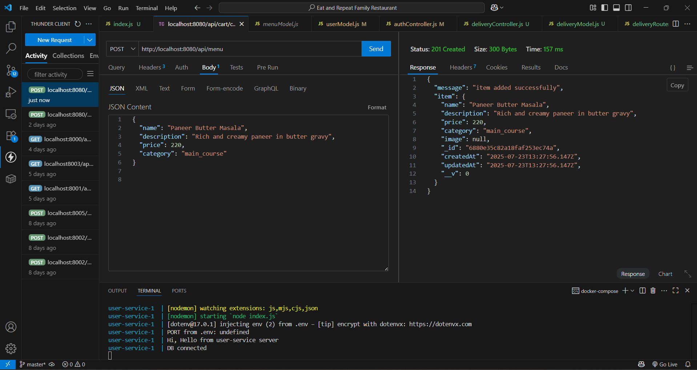

# 🍽️ Eat and Repeat - Family Restaurant App

A microservices-based restaurant management system for a seamless digital dining experience. This app supports user authentication, menu browsing, cart management, order placement, payment processing, and delivery tracking.

> ✅ **Backend (complete)**: All services containerized with Docker & integrated via API Gateway  
> 🚧 **Frontend (pending)**: Planned to be built using React.js  
> 🧪 **Tested** with Thunder Client (screenshots included)

---

## 🛠️ Tech Stack

This project is built using the **MERN Stack** and follows a **Microservices Architecture**.

- **MongoDB** – NoSQL database for each microservice (hosted on MongoDB Atlas)
- **Express.js** – Lightweight web framework for building APIs
- **React.js** – Frontend (planned)
- **Node.js** – Runtime environment to run backend services
- **Docker** – Containerized microservices for easy deployment
- **Docker Compose** – To run all services together in an isolated environment
- **API Gateway** – Central entry point to route requests to different services


## ⚙️ Backend Microservices

| Service           | Description                                       | Folder Path                      |
|-------------------|---------------------------------------------------|----------------------------------|
| 👤 **User Service**     | Manages user details and roles                  | `backend/user-service/`          |
| 🔐 **Auth Service**     | Firebase-based user authentication              | `backend/auth-service/`          |
| 🍽️ **Menu Service**     | Menu CRUD: add, update, view food items         | `backend/menu-service/`          |
| 🛒 **Cart Service**     | Handles user's cart (add/remove/view items)     | `backend/cart-service/`          |
| 📦 **Order Service**    | Order placement, status updates                 | `backend/order-service/`         |
| 💳 **Payment Service**  | Payment gateway (mock/payments tracking)        | `backend/payment-service/`       |
| 🛵 **Delivery Service** | Assigns & tracks deliveries                     | `backend/delivery-service/`      |
| 🌐 **API Gateway**      | Routes all external requests to services        | `Eat and Repeat Family Restaurant/api-gateway/`           |

---

## 🐳 Dockerized Setup

Each service has:
- `Dockerfile` to containerize the service
- `.env` for environment configuration
- Express-based backend logic

### 🧩 Docker Compose

All services are orchestrated using Docker Compose.

```bash
docker-compose up --build
```

## 🌐 API Gateway Routing
The API Gateway handles all routing logic using http-proxy-middleware.

Incoming Route	Redirected to
- /api/auth/...	Auth Service
- /api/user/...	User Service
- /api/menu/...	Menu Service
- /api/cart/...	Cart Service
- /api/order/...	Order Service
- /api/payments/...	Payment Service
- /api/delivery/...	Delivery Service

All frontend-to-backend communication passes through the gateway.


### 🚀 Setup Instructions
## ✅ Prerequisites

Make sure the following are installed:

- [Docker](https://www.docker.com/)
- [Git](https://git-scm.com/)

> 💡 MongoDB Atlas is used — no local MongoDB setup needed.

---

### 📦 Step-by-Step Guide

1. **Clone the Repository**

```bash
git clone https://github.com/shubhanjali04/Eat-and-Repeat-Family-Restaurant.git
cd Eat-and-Repeat-Family-Restaurant
```
### Add .env Files

Each microservice inside /backend/ contains a .env.example.
Copy it to .env in the same folder:
```
cd backend/auth-service/
cp .env.example .env
```
# Repeat for each service:
 user-service, menu-service, cart-service, order-service, payment-service, delivery-service

 🔐 MongoDB Atlas URLs are already set in the example files.

Start All Services Using Docker Compose

```bash
docker-compose up --build
```
This will build and run all microservices along with the API Gateway.

### ✅ Check Services (via API Gateway)
Use Postman or Thunder Client to test services.
All requests should go through API Gateway on:

```
http://localhost:8080
```
Service	Endpoint Example
- Auth Service	POST /api/auth/register
- Auth Service	POST /api/auth/login
- Auth Service	POST /api/auth/logout
- User Service	GET /api/user/
- Menu Service	GET /api/menu/
- Menu Service	POST /api/menu/ (POST for adding item)
- Cart Service	POST /api/cart/add
- Order Service	PUT /api/order/cancel/:orderId
- Order Service	POST /api/order/placeorder
- Order Service	PUT /api/order/updatestatus/:orderId
- Payment Service	POST /api/payments/createorder
- Payment Service POST /api/payments/verifypayment
- Delivery Service PUT /api/delivery/complete/:id
- Delivery Service	GET /api/delivery/status/all
- Delivery Service	POST /api/delivery/assign

⚠️ Make sure routes are correctly mapped in API Gateway using axios or any proxy middleware.


## 🔧 Upcoming Enhancements

The following features and services are planned as part of future development to enhance the overall functionality and user experience of the **Eat and Repeat Family Restaurant** app:

- 🤖 **AI Integration**  
  Smart recommendations based on user preferences and order history.

- 🌟 **Review & Rating Service**  
  Allow users to rate dishes and share feedback after ordering.

- 🗣️ **Feedback Service**  
  Collect structured feedback to improve food quality and service.

- 🛠️ **Admin Service**  
  Admin panel for managing users, orders, menu items, and analytics.

- 🔔 **Notification Service**  
  Real-time updates via email/SMS/push for order confirmation, dispatch, and delivery.

- 💻 **Frontend UI** (Planned)  
  A modern, responsive frontend using **React** to consume the backend APIs through the API Gateway.


 #### API Testing Screenshots(Thunder Client)

 ### 📦 Auth Service

  
*Register API tested via Thunder Client*

  
*Login API tested via Thunder Client*

  
*Logout API tested via Thunder Client*

---

### 📋 Menu Service

  
*View all menu items using menuItemId*

  
*Add a new menu item*

---

### 🛒 Cart Service

  
*Add item to cart*

---

### 🧾 Order Service

  
*Place order API*

---

### 💳 Payment Service

  
*Payment gateway simulation*

  
*Verify payment transaction*

---

### 🚚 Delivery Service

  
*Assign/Track delivery status*


 ### 🙌 Acknowledgement

I would like to express my sincere gratitude to **Celebal Technologies** for providing me the opportunity to work on this project as part of my internship. This experience has been a valuable milestone in my learning journey, offering deep insights into real-world software development practices.

I am especially thankful to my mentor, **Mr. Ayush Rathore sir**, for his constant guidance, encouragement, and constructive feedback throughout the project. His support and mentorship were instrumental in the successful completion of this project. Also, A special thanks to him for giving me the idea and motivation to build something this impactful and scalable.

I also extend my appreciation to all team members and peers who supported me directly or indirectly during this internship.

Through this project, I gained practical experience in:
- Building backend microservices using **Node.js** and **Express.js**  
- Containerizing services with **Docker** and orchestrating them using **Docker Compose**  
- Integrating services through an **API Gateway**  
- Testing REST APIs with **Thunder Client**  
- Managing code and version control using **Git** and **GitHub**

The technical skills and experience acquired during this internship will greatly benefit my future endeavors in software engineering.


## 👩‍💻 Author

**Shubhanjali Pandey**  
[GitHub](https://github.com/shubhanjali04)


